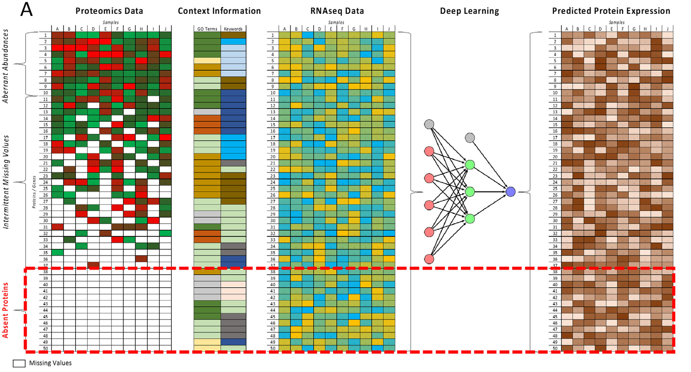

# Using Deep Learning to Extrapolate Protein Expression Measurements

This repository contains the code for reproducing key results of the following paper:
**Using Deep Learning to Extrapolate Protein Expression Measurements**  by Mitra Parissa Barzine, Kārlis Freivalds, 
James C. Wright, Mārtiņš Opmanis, Darta Rituma,
Fatemeh Zamanzad Ghavidel, Andrew F. Jarnuczak, Edgars Celms, Kārlis Čerāns,
Inge Jonassen, Lelde Lace, Juan Antonio Vizcaíno, Jyoti Choudhary, Alvis Brazma,
and Juris Viksna

> Published in [[Proteomics and Systems Biology](https://onlinelibrary.wiley.com/doi/abs/10.1002/pmic.202000009)]
>
>Abstract: _Mass spectrometry (MS)-based quantitative proteomics experiments typically
assay a subset of up to 60% of the ≈20 000 human protein coding genes.
Computational methods for imputing the missing values using RNA
expression data usually allow only for imputations of proteins measured in at
least some of the samples. In silico methods for comprehensively estimating
abundances across all proteins are still missing.
Here, a novel method is proposed using deep learning to extrapolate the
observed protein expression values in label-free MS experiments to all
proteins, leveraging gene functional annotations and RNA measurements as
key predictive attributes. This method is tested on four datasets, including
human cell lines and human and mouse tissues. This method predicts the
protein expression values with average R2 scores between 0.46 and 0.54,
which is significantly better than predictions based on correlations using the
RNA expression data alone. Moreover, it is demonstrated that the derived
models can be “transferred” across experiments and species. For instance, the
model derived from human tissues gave a R2 = 0.51 when applied to mouse
tissue data. It is concluded that protein abundances generated in label-free
MS experiments can be computationally predicted using functional annotated
attributes and can be used to highlight aberrant protein abundance values._

## Summary of the approach

We use deep learning methods to predict the values for unobserved proteins in MS-proteomics experiments.
Measured protein expression values in combination with context information such as functional annotations and RNAseq measurements are used to
train a neural network which can predict protein expression for all proteins, including those not experimentally measured in any sample.

## Running the code 
See this [guide](assets/DLNetworkForProteinAbundancePreparationAndPredictionDescription.pdf) on running the code.

## Contact information

For help or issues with this code, please submit a _GitHub_ issue.

For personal communication related to the paper please contact Juris Viksna ([juris.viksna@lumii.lv](mailto:juris.viksna@lumii.lv)).
